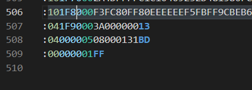
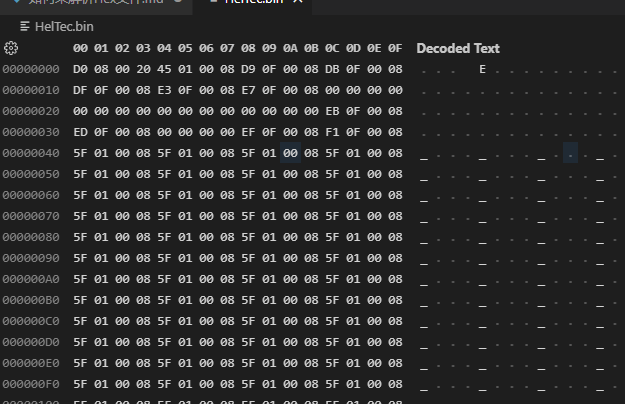

# 如何来解析Hex文件

1. 记录的起始于： （0x3A)
2. 1 byte 数据域长度
3. 2 byte 字节起始地址域
4. 1 bye记录数据的类型 00 表示数据记录， 0x01表示文件接收
   0x04 ：  0x05 0x02 等等都表示成什么呢
5. 数据域（每个字节由2个 ASCII码组成，高位在前）文件结束记录没有数据域
6. 1 byte的校验和域
7. 最后以回车换行结束
8. 
9. 转换bin文件后

